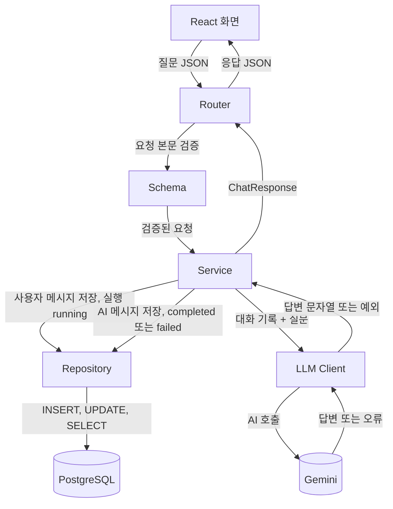

flowchart TB
   React[React 화면]
   Router[Router]
   Schema[Schema]
   Service[Service]
   LLM[LLM Client]
   Repo[Repository]
   Gemini[(Gemini)]
   PG[(PostgreSQL)]


   React -->|질문 JSON| Router
   %% 여기부터 화살표를 채웁니다.


| 항목 | 질문 전송 (예시) | 대화 생성 | 대화 조회 |
|---|---|---|---|
| 사용자 행동 | 질문 전송 | | |
| Method·URL | `POST /api/conversations/{id}/messages` | | |
| Path Parameter | `id: integer` | | |
| Request Body | `{ "content": "string" }` | | |
| Success | `200` + 사용자·AI 메시지 | | |
| Error | `404` 대화 없음 · `422` 입력 오류 · `502` Gemini 실패 | | |


New-Item -ItemType Directory -Force "$env:USERPROFILE\ai-native-course"
Set-Location "$env:USERPROFILE\ai-native-course"
uv init --python 3.13 ai-native-service
Set-Location ai-native-service
if (Test-Path main.py) { Remove-Item main.py }
uv add "fastapi[standard]"
uv run python -c "import fastapi, pydantic; print(pydantic.VERSION)"


# AI Native Service

질문을 받아 AI 답변을 돌려주고, 대화와 AI 실행 이력을 저장하는 대화형 AI 서비스입니다.

## 아키텍처 초안

React · FastAPI(Router · Schema · Service · LLM Client · Repository) · Gemini · PostgreSQL



- React 는 FastAPI 만 호출하고 Gemini 와 PostgreSQL 에 직접 닿지 않습니다.
- AI 호출과 저장 순서는 Service 한 곳에서 정합니다.
- Gemini 연결은 LLM Client, SQL 은 Repository 에 둡니다. 모델을 바꾸면 LLM Client 만 고칩니다.
- AI 실행은 호출 전에 `running` 으로 저장하고, 끝나면 `completed` 또는 `failed` 로 바꿉니다.

## API 명세

| 사용자 행동 | Method·URL | Success | Error |
|---|---|---|---|
| 새 대화 시작 | `POST /api/conversations` | `201` | `422` 제목 누락·빈 제목·100자 초과 |
| 대화 목록 확인 | `GET /api/conversations` | `200` | `500` 서버 조회 실패 |
| 질문 전송 | `POST /api/conversations/{id}/messages` | `200` | `404` 대화 없음 · `422` 입력 오류 · `502` Gemini 실패 |

```json
{ "content": "FastAPI의 장점을 설명해 줘" }
```

```json
{
  "conversation_id": 42,
  "user_message": { "id": 1, "role": "user", "content": "FastAPI의 장점을 설명해 줘" },
  "assistant_message": { "id": 2, "role": "assistant", "content": "..." }
}
```


