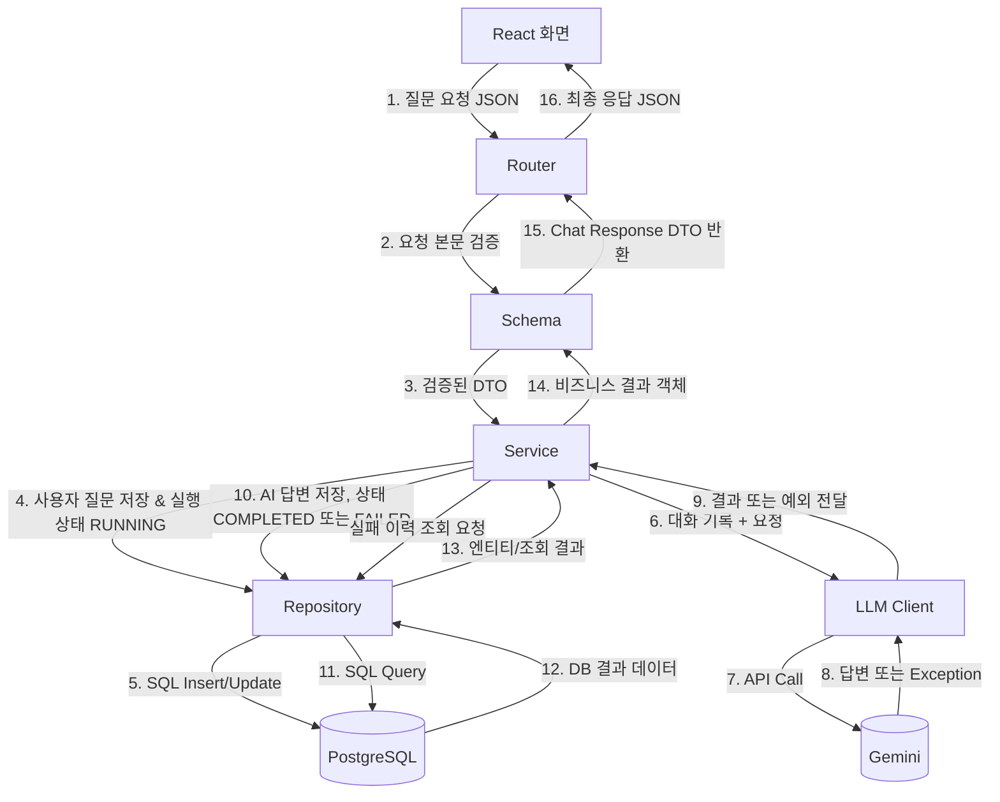

# AI Native Service

질문을 받아 AI 답변을 돌려주고, 대화와 AI 실행 이력을 저장하는 대화형 AI 서비스입니다.

## 아키텍처 초안

React · FastAPI(Router · Schema · Service · LLM Client · Repository) · Gemini · PostgreSQL



- React 는 FastAPI 만 호출하고 Gemini 와 PostgreSQL 에 직접 닿지 않습니다.
- AI 호출과 저장 순서는 Service 한 곳에서 정합니다.
- Gemini 연결은 LLM Client, SQL 은 Repository 에 둡니다. 모델을 바꾸면 LLM Client 만 고칩니다.
- AI 실행은 호출 전에 `running` 으로 저장하고, 끝나면 `completed` 또는 `failed` 로 바꿉니다.

## API 명세

모든 엔드포인트는 요청자 식별용 `X-Client-Id` 헤더(`student-`로 시작)가 필요합니다. 헤더가 없으면 `422`, 형식이 맞지 않으면 `400`을 반환합니다.

| 사용자 행동 | Method·URL | 구현 상태 | Success | Error |
|---|---|---|---|---|
| 새 대화 시작 | `POST /api/conversations` | 예정 | `201` | `422` 제목 누락·빈 제목·100자 초과 |
| 대화 목록 확인 | `GET /api/conversations` | 예정 | `200` | `500` 서버 조회 실패 |
| 질문 전송 | `POST /api/conversations/{id}/messages` | 구현됨 | `200` | `400` 잘못된 `X-Client-Id` · `422` 헤더 누락·입력 오류 · `502` Gemini 실패(예정) |

```json
{ "content": "FastAPI의 장점을 설명해 줘" }
```

```json
{
  "conversation_id": 42,
  "user_message": { "id": 1, "role": "user", "content": "FastAPI의 장점을 설명해 줘" },
  "assistant_message": { "id": 2, "role": "assistant", "content": "..." }
}
```

## 실행 방법

```bash
# 서버 실행
uv run fastapi dev app/main.py

# 테스트 실행
uv run pytest
```

